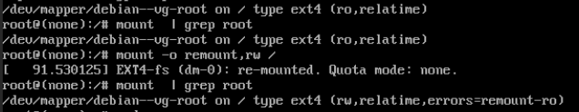
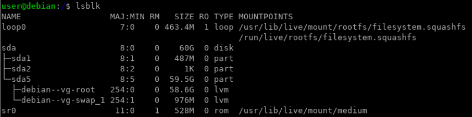
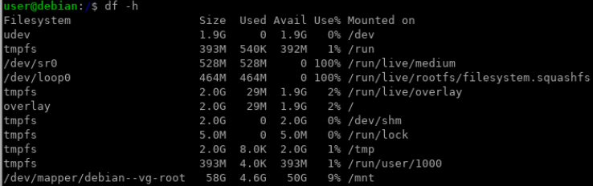
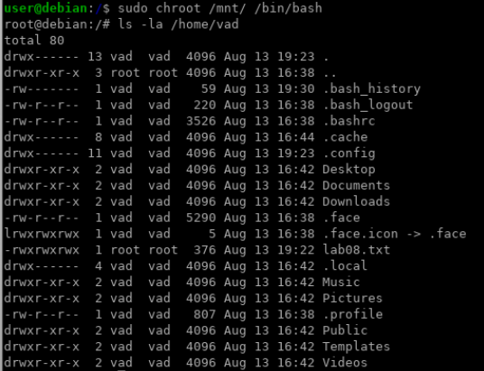
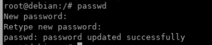

# Lab 8 Загрузка системы

Задачи:
1. Включить отображение меню Grub.
2. Попасть в систему без пароля несколькими способами.
3. Установить систему с LVM, после чего переименовать VG.

## 1. Включить отображение меню Grub 
## 2. Попасть в систему без пароля несколькими способами
Узнаем версию ОС
```
cat /etc/*release
PRETTY_NAME="Debian GNU/Linux 12 (bookworm)"
NAME="Debian GNU/Linux"
VERSION_ID="12"
```
Отредактируем меню загрузчика GRUB
```
nano /etc/default/grub
#GRUB_CMDLINE_LINUX_DEFAULT="quit"
```
Обновляем загрузчик и перезагружаем ВМ
```
update-grub
reboot
```
В конце строки, начинающейстя со слова linux, добавляем init=/bin/bash
Монтируем файловую систему и проверяем результат
```
mount -o remount,rw /
mount | grep root
```


## Альтернативный способ попасть в систему под рутом при помощи liveCD

Загружаемся с live, смотрим блочные устройства   


Далее мотируем логический том в каталог /mnt, проверяем   


Командой chroot меняем рабочее окружение операциооной системы.   
Корневой каталог будет монтироваться из точки /mnt   
Проверяем содержимое домашнего каталога   


Как мы видим, монтирование прошло удачно, и мы под рутом.   
Можно также поменять руту пароль        
   

## 3. Установить систему с LVM, после чего переименовать VG

Переименовываем vollume group
```
vgrename debian-vg deb-vg
```
Правим /etc/fstab, чтобы загрузка велась с коррестного тома
```
nano /etc/fstab
/dev/mapper/deb--vg-root /               ext4    errors=remount-ro 0       1
/dev/mapper/deb--vg-swap_1 none            swap    sw              0       0
```
Редактируем раздел подкачки
```
nano /etc/initramfs-tools/conf.d/resume
RESUME=/dev/mapper/deb--vg-swap_1
```
Правим конфиг загрузчика
```
nano /boot/grub/grub.cfg
echo    'Loading Linux 6.1.0-23-686-pae ...'
        linux   /vmlinuz-6.1.0-23-686-pae root=/dev/mapper/deb--vg-root ro  qui>
        echo    'Loading initial ramdisk ...'
        initrd  /initrd.img-6.1.0-23-686-pae
```
Пересобираем загрузочный образ initrd при помощи утилиты dracut и перезагружаем ВМ
```
dracut -v -f /boot/initrd.img-6.1.0-$(uname -r).img $(uname -r)
reboot
```
После загрузки проверяем имя группы
```
vgs
  VG     #PV #LV #SN Attr   VSize   VFree 
  deb-vg   1   2   0 wz--n- <59.52g 12.00m
```
Как мы видим, ОС успешно загрузилась, группа переименована


